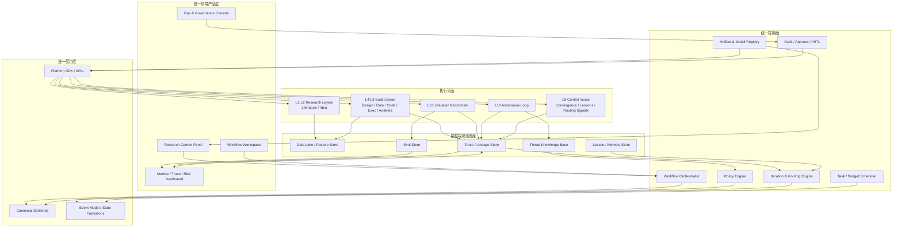
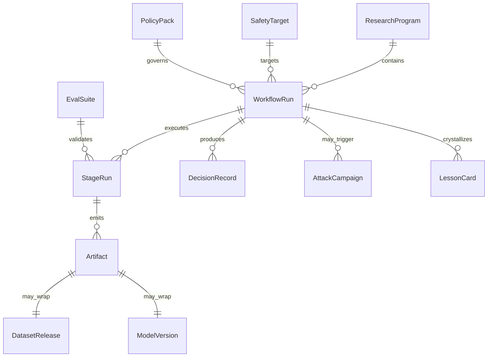
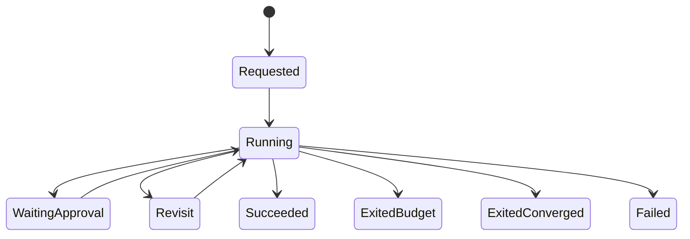

# 通用安全算法研发平台架构设计文档

日期：2026-07-20

状态：Draft v1

> ⚠️ **与现实实现的差距（2026-08-07 标注）**：本文是 2026-07-20 的**目标架构**草案，写于 MEA 控制循环与 OpenRSI/OpenMLE 集成**落地之前**。后续 `doc/mea_harness_upgrade_plan.md`（MEA 已落地）、`doc/openrsi_openmle_integration_analysis.md`（OpenRSI Phase A–D 已落地）、`doc/code_review_STATUS.md`（隔离/并发/ RCE 修复）已部分实现本文目标；本文未回写这些落地，仅作方向性参考，不与现状逐一对照。
关联文档：
- `infrastructure/README.md`：现有十层基础设施总览
- `doc/AI_Research_for_safety.md`：安全 auto-research 方法论方向
- `doc/Adversarial_safety_multi_Agent.md`：对抗与红蓝协同设计参考

---

## 1. 文档目标

本文档定义一个面向**通用安全算法研发**的平台级目标架构，用于把当前 `safety_auto_research/infrastructure/` 中已经沉淀的十层能力，收敛为一个具备以下特征的统一平台：

1. **统一契约层**：不同阶段、不同 agent、不同评测框架共享同一套核心对象模型、事件模型与状态机。
2. **统一控制面**：所有研究链路、数据闭环、红队闭环、自迭代决策由统一编排与治理平面驱动。
3. **统一前端平台**：研发、评测、红队、治理、审计、可视化在同一产品入口中完成。
4. **通用安全目标支持**：不仅支持内容安全，还支持提示注入、RAG 泄露、Agent 越权、多模态绕过、安全路由等算法研发场景。

本文档关注**目标平台架构**，不是一次性实现说明，也不是单一模型或单一任务的实验设计文档。

---

## 2. 背景与问题定义

现有 `infrastructure/` 已形成覆盖文献检索、idea 生成、实验设计、数据清洗、代码开发、实验执行、结果分析、评估基准、自迭代进化、数据生成对抗的十层能力地图，具备较强的方法论完整性。

但当前形态仍主要是**分层资产沉淀库**，而非**统一可运行平台**。其主要问题包括：

1. 各层已有 skill、agent、数据资产与评测方法，但缺少统一入口和统一运行时。
2. 跨层集成大量依赖 README 中的“跨层引用”，缺少稳定 API 与强类型契约。
3. 关键阶段对象如数据版本、模型版本、评测结果、红队结果、经验卡等尚未被收敛为统一对象模型。
4. 现有 ⑨ 自迭代更接近控制平面概念定义，尚未演进为真正的平台级 runtime 服务。
5. 统一前端产品层尚不存在，用户仍需在目录、脚本、不同 agent 入口之间切换。

因此，平台化工作的核心不是“再增加一个 agent”，而是建立：

- 可跨层复用的**统一契约层**
- 统一调度、审计与治理的**控制面**
- 面向用户的一体化**前端产品工作台**

---

## 3. 设计目标

### 3.1 核心目标

1. 把十层基础设施收敛成一个统一平台，而不是推翻重写。
2. 把“研究资产复用”升级为“平台运行时复用”。
3. 让标准研究链路、badcase 重训链路、对抗硬化链路都运行在同一控制面中。
4. 让平台具备持续优化能力，而不是一次性离线实验能力。
5. 让平台兼顾研发效率、可追溯性、合规性、红队受控和平台可治理性。

### 3.2 质量目标

1. **一致性**：所有阶段以统一 schema 和事件流沟通。
2. **可追溯性**：任意结论可回溯到输入、代码、评测、红队和审批记录。
3. **通用性**：支持不同安全目标与模态，而不把架构绑定到内容审核单场景。
4. **可治理性**：高风险攻击、危险载荷、跨模型评审、数据合规均可策略化约束。
5. **可演化性**：支持新 agent、新 benchmark、新 threat model 以插件方式接入。

---

## 4. 非目标

本文档不试图解决以下问题：

1. 不定义某一个具体模型的训练细节或网络结构。
2. 不替代各层已有的上游实现细节，如 MLEvolve、Arbor、ResearchClaw、AutoLab 内部逻辑。
3. 不要求第一阶段即完成所有十层的完全统一重构。
4. 不把平台设计为通用 MLOps 平台；它首先是**安全算法研发平台**。
5. 不在 v1 中解决所有线上推理服务问题；在线部署与在线 serving 仅定义接口与回流边界。

---

## 5. 设计原则

### 5.1 平台优先于目录

`infrastructure/` 是能力地图，不是最终产品边界。平台以运行时对象、状态机和工作流为主轴，而不是以目录树为主轴。

### 5.2 契约优先于脚本

每个层级可以保留自己的 agent 与脚本，但必须通过统一契约层接入，不再直接以松散文件格式耦合。

### 5.3 控制面与执行面分离

⑨ 自迭代能力应升级为平台控制面的一部分，而不是散落在不同 README 与脚本中的决策逻辑。

### 5.4 安全治理内建

红队受控、跨模型强制、PII 脱敏、危险载荷指纹化、HITL 审批、canary 防污染、group+time 隔离必须是平台内建能力，而非人工约定。

### 5.5 渐进式收编

优先通过 adapter 收编现有 01-10 层能力，而不是立刻用新平台完全替换旧实现。

---

## 6. 总体目标架构

### 6.1 架构含义

平台分为五层：

1. **统一前端产品层**：提供统一用户入口与工作流体验。
2. **统一控制面**：负责编排、调度、治理、审计、回退、退出和经验回注。
3. **统一契约层**：负责 schema、事件、状态机、SDK、对象校验。
4. **执行平面**：承接现有 01-10 层实现，不要求一开始重写。
5. **数据与观测底座**：提供数据、评测、trace、memory、threat knowledge 的统一存储与查询能力。

---

## 7. 平台功能视角

### 7.1 三条主工作流

平台必须原生支持以下三类工作流：

1. **标准研究链路**
   - 入口：研究问题、目标安全能力、威胁模型
   - 流程：01 → 02 → 04 → 05 → 06 → 07 → 08 → 03 → 09

2. **badcase 驱动重训链路**
   - 入口：已优化模型 + badcase 池
   - 流程：05 → 06 → 07 → 03 → 08 → 09

3. **对抗硬化链路**
   - 入口：已优化模型 + 攻击策略 + 风险约束
   - 流程：10 → 05 → 06 → 07 → 03 → 09

### 7.2 四类平台用户

1. **Research Lead**：定义目标、追踪实验、决定继续或停止。
2. **Algorithm Engineer**：消费数据、模型、评测与失败簇，推进模型改进。
3. **Red Team / Safety Engineer**：定义攻击活动、审查高风险对抗样本、管理漏洞模式。
4. **Platform / Governance Owner**：管理策略、审批、预算、配额、追踪与审计。

---

## 8. 核心对象模型

平台统一对象模型应至少覆盖以下 12 个核心对象。

### 8.1 对象总表

| 对象 | 作用 | 典型生产者 | 典型消费者 |
|------|------|-----------|-----------|
| `ResearchProgram` | 平台级项目/研发计划 | 前端 / 控制面 | 控制面 / 前端 |
| `SafetyTarget` | 被优化的安全目标定义 | 研究者 / 策略系统 | 全链路 |
| `WorkflowRun` | 一次完整运行实例 | 控制面 | 全链路 |
| `StageRun` | 单阶段执行实例 | 控制面 / adapter | 前端 / 控制面 |
| `Artifact` | 统一产物元对象 | 任意阶段 | 任意阶段 |
| `DatasetRelease` | 数据版本与清洗/配比产物 | 05 / 10 | 06 / 07 / 03 |
| `ModelVersion` | 模型版本对象 | 07 | 03 / 10 / 前端 |
| `EvalSuite` | 统一评测包 | 03 / 策略系统 | 03 / 控制面 |
| `AttackCampaign` | 红队活动对象 | 10 | 05 / 09 / 前端 |
| `DecisionRecord` | 控制面决策记录 | 09 / 控制面 | 前端 / 审计 |
| `LessonCard` | 经验沉淀对象 | 08 / 09 | 04 / 05 / 10 |
| `PolicyPack` | 策略与治理规则包 | 平台管理员 | 控制面 / 审计 |

### 8.2 关键对象定义

#### 8.2.1 ResearchProgram

表示一个持续迭代的安全研发项目。

核心字段：

- `program_id`
- `name`
- `domain`
- `owner`
- `goal_statement`
- `risk_tier`
- `budget_policy_ref`
- `default_policy_pack_ref`
- `status`

#### 8.2.2 SafetyTarget

表示当前平台要优化的“安全对象”，是平台通用化的关键抽象。

核心字段：

- `target_id`
- `target_type`
- `modality`
- `task_family`
- `capabilities`
- `threat_model_refs`
- `acceptance_policy_ref`

推荐 `target_type`：

- `classifier`
- `judge`
- `router`
- `rag_guard`
- `agent_guard`
- `multimodal_detector`

#### 8.2.3 WorkflowRun

表示一次完整工作流运行。

核心字段：

- `run_id`
- `program_id`
- `run_type`
- `entry_stage`
- `target_id`
- `objective_snapshot`
- `requested_outcomes`
- `status`
- `started_at`
- `ended_at`

推荐 `run_type`：

- `standard_research`
- `badcase_retrain`
- `adversarial_hardening`

#### 8.2.4 StageRun

表示某个阶段的一次执行。

核心字段：

- `stage_run_id`
- `run_id`
- `stage_code`
- `input_refs`
- `output_refs`
- `executor_family`
- `reviewer_family`
- `gate_result`
- `status`
- `retry_count`

#### 8.2.5 Artifact

`Artifact` 是统一平台化的核心。所有阶段产物都先收敛到它，再细分为具体类型。

核心字段：

- `artifact_id`
- `artifact_type`
- `uri`
- `schema_version`
- `producer_ref`
- `lineage_parent_ids`
- `integrity_hash`
- `visibility`
- `compliance_tags`

推荐 `artifact_type`：

- `paper_set`
- `idea_card`
- `design_spec`
- `dataset_release`
- `code_patch`
- `model_checkpoint`
- `eval_report`
- `attack_report`
- `lesson_card`

#### 8.2.6 DatasetRelease

统一描述训练/评测数据版本。

核心字段：

- `dataset_id`
- `artifact_ref`
- `source_mix`
- `label_schema_version`
- `pii_status`
- `split_policy`
- `retention_policy`
- `quality_report_ref`
- `leakage_report_ref`

#### 8.2.7 ModelVersion

统一描述模型版本。

核心字段：

- `model_id`
- `base_model`
- `adapter_stack`
- `training_recipe_ref`
- `safety_capabilities`
- `artifact_ref`
- `registry_status`

#### 8.2.8 EvalSuite

统一描述评测集合。

核心字段：

- `eval_suite_id`
- `suite_type`
- `task_refs`
- `metric_defs`
- `pass_thresholds`
- `sandbox_policy_ref`
- `canary_policy_ref`

#### 8.2.9 AttackCampaign

统一描述一次对抗攻击活动。

核心字段：

- `campaign_id`
- `target_model_id`
- `attack_taxonomy_refs`
- `generation_policy_ref`
- `risk_controls`
- `success_metrics`
- `replay_buffer_ref`

#### 8.2.10 DecisionRecord

统一描述控制面的判断结果。

核心字段：

- `decision_id`
- `run_id`
- `decision_type`
- `target_stage`
- `reason_codes`
- `evidence_refs`
- `policy_hits`
- `approved_by`

推荐 `decision_type`：

- `continue`
- `revisit`
- `exit_success`
- `exit_budget`
- `exit_converged`
- `hitl_required`

#### 8.2.11 LessonCard

统一描述可复用经验，而不是自由文本备注。

核心字段：

- `lesson_id`
- `scope`
- `source_run_id`
- `pattern_type`
- `applicable_stages`
- `confidence`
- `payload_ref`
- `prm_score`

#### 8.2.12 PolicyPack

统一描述治理规则集合。

核心字段：

- `policy_pack_id`
- `domain`
- `rules`
- `required_approvals`
- `model_separation_policy`
- `data_compliance_policy`
- `redteam_constraints`

### 8.3 对象关系

---

## 9. 统一契约层设计

统一契约层由三个部分组成：schema registry、event contract、platform SDK。

### 9.1 Schema Registry

所有核心对象必须注册在 schema registry 中，并满足以下要求：

1. 每个对象必须有 `schema_version`。
2. 所有 breaking changes 必须通过版本升级显式表达。
3. 平台 adapter 只能读写已注册 schema。
4. 前端只渲染 canonical object，不直接解析层内私有文件。

### 9.2 Event Contract

所有阶段交互统一通过事件驱动的状态流转完成。建议的最小事件集合：

- `ProgramCreated`
- `WorkflowRequested`
- `WorkflowStarted`
- `StageQueued`
- `StageStarted`
- `ArtifactPublished`
- `GatePassed`
- `GateFailed`
- `EvalCompleted`
- `AttackCompleted`
- `DecisionIssued`
- `LessonPromoted`
- `ApprovalRequired`
- `ApprovalResolved`
- `WorkflowFinished`

### 9.3 状态机原则

状态转移必须满足：

1. **阶段状态单调演进**：禁止同一个 `StageRun` 无留痕回写旧状态。
2. **决策后续化**：所有回退、退出、继续必须由 `DecisionRecord` 驱动，而非脚本隐式跳转。
3. **高风险动作可阻塞**：`ApprovalRequired` 可中断自动流水线，等待 HITL。
4. **经验写入延后**：只有 closure signal 满足时，`LessonCard` 才从临时观察升级为平台对象。

### 9.4 Platform SDK

所有执行平面 adapter 都只做四件事：

1. 读取输入对象。
2. 执行本层逻辑。
3. 发布输出对象。
4. 发送状态事件。

SDK 建议提供以下标准接口：

- `load_object(object_ref)`
- `publish_artifact(payload, schema_version, metadata)`
- `emit_event(event_type, payload)`
- `request_approval(payload)`
- `record_metric(metric_name, value, tags)`
- `register_lesson(payload)`

---

## 10. 统一控制面设计

统一控制面是平台的大脑，不直接参与模型训练或红队生成，而是负责组织、约束、观测与决策。

### 10.1 控制面组件

#### 10.1.1 Workflow Orchestrator

职责：

- 创建 `WorkflowRun`
- 拆分 `StageRun`
- 调用执行平面 adapter
- 处理阶段重试、跳过、终止

#### 10.1.2 Iteration & Routing Engine

职责：

- 吸收现有 ⑨ 的收敛、停滞、回退、退出与经验回注能力
- 根据 metrics、gate、trace 和 lessons 生成 `DecisionRecord`
- 优先回退到最早失效环节，而不是末端打补丁

#### 10.1.3 Policy Engine

职责：

- 执行跨模型强制
- 执行红队沙箱策略
- 执行危险载荷脱敏与只存指纹策略
- 执行数据合规与评测 canary 规则

#### 10.1.4 Task / Budget Scheduler

职责：

- GPU/CPU 配额分发
- 预算上限控制
- 并发与优先级策略
- 失败重试和排队控制

#### 10.1.5 Artifact & Model Registry

职责：

- 注册模型、数据、评测、红队、分析与经验对象
- 管理 lineage 和完整性哈希
- 提供前端查询入口

#### 10.1.6 Audit / Approval / HITL

职责：

- 高风险攻击审批
- 高影响策略变更审批
- 人审断点与留痕
- 审计查询

### 10.2 控制面决策逻辑

统一控制面必须支持以下决策：

1. **Continue**：当前阶段通过，继续下游阶段。
2. **Revisit**：定位最早失效环节并回退。
3. **Exit Success**：目标指标、护栏指标、治理条件同时满足。
4. **Exit Budget**：预算或资源阈值触发退出。
5. **Exit Converged**：收敛无新范式且继续收益不足。
6. **HITL Required**：高风险活动或重要策略变更必须人审。

### 10.3 最小控制面状态机

---

## 11. 执行平面与现有十层的映射

平台不替换现有十层，而是把其收编为执行平面。

### 11.1 分层映射

| 平台平面 | 对应层 | 平台职责 |
|---------|-------|---------|
| `Research Plane` | 01, 02 | 文献、idea、先验碰撞、claim 审查 |
| `Build Plane` | 04, 05, 06, 07, 08 | 设计、数据、代码、执行、分析 |
| `Benchmark Plane` | 03 | 统一评测与 benchmark gate |
| `Adversarial Plane` | 10 | 红队、失败分析、对抗生成、防遗忘 |
| `Control Inputs` | 09 | 收敛、回退、经验回注、停止条件 |

### 11.2 Adapter 策略

每层以 adapter 接入平台，而不是要求立刻内部重构。

adapter 负责：

1. 将平台对象转换为该层可消费输入。
2. 调用已有脚本、agent 或 workflow。
3. 把产出转换回 canonical object。
4. 发送平台事件。

---

## 12. 统一前端产品架构

### 12.1 产品定位

前端不是展示页，也不是简单后台；它是安全算法研发平台的统一工作台。

其目标是让用户在一个入口中完成：

1. 发起工作流
2. 追踪阶段运行
3. 查看数据、模型、评测、红队结果
4. 审批高风险动作
5. 分析失败与收益
6. 追踪谱系与审计记录

### 12.2 信息架构

建议前端主导航包含以下页面：

1. **项目总览**
   - Program 列表
   - 当前目标
   - 本周指标变化
   - 预算与风险

2. **运行工作台**
   - 创建 `WorkflowRun`
   - 选择标准研究 / badcase 重训 / 对抗硬化
   - 查看各 `StageRun` 状态、输入、输出、gate

3. **数据与模型中心**
   - `DatasetRelease`
   - `ModelVersion`
   - 混配策略、泄露检查、保留率、回放缓冲

4. **评测与基准中心**
   - `EvalSuite`
   - leaderboard
   - regression 对比
   - canary 与 sandbox 状态

5. **对抗实验室**
   - `AttackCampaign`
   - 漏洞模式
   - ASR、保留率、遗忘率
   - 失败簇与 replay 建议

6. **决策与治理中心**
   - `DecisionRecord`
   - `PolicyPack`
   - 审批流
   - HITL 阻塞点

7. **谱系与追踪中心**
   - 从问题到数据、模型、评测、攻击、经验卡的全链路 lineage

### 12.3 关键前端交互

前端需要优先解决以下问题：

1. 当前 run 卡在哪一层，为什么卡住。
2. 这一轮提升来自哪里，是数据修复、代码改进还是对抗硬化。
3. 这次回退的依据是什么，依据引用了哪些证据。
4. 哪些攻击或数据处理需要审批。
5. 哪些经验已经被结晶为可复用 lesson。

---

## 13. 安全与治理要求

### 13.1 红队受控

1. 红队执行必须运行在隔离沙箱中。
2. 高风险 payload 默认只保存指纹或引用，不保存明文。
3. 高危成功率提升触发 `HITL Required`。

### 13.2 跨模型强制

1. 安全关键评审默认要求 executor 与 reviewer 不同模型家族。
2. 红队与被攻击模型默认不同模型家族。
3. 裁判模型与攻击/防御模型解耦。

### 13.3 数据合规

1. badcase 数据进入平台前必须经过 PII 脱敏。
2. 训练、验证、测试保持 group+time 隔离。
3. `DatasetRelease` 必须绑定 `leakage_report_ref`。

### 13.4 可追溯性

1. 所有 `Artifact` 必须有完整 lineage。
2. 所有关键决策必须生成 `DecisionRecord`。
3. 所有评测与红队活动必须保留 canary、策略包和审批证据。

---

## 14. 分阶段实施路线图

### Phase 0：对象模型与契约收敛

目标：为平台奠定统一语言。

交付物：

1. 12 个核心对象 schema 初版
2. 事件模型初版
3. schema registry
4. artifact registry 原型

### Phase 1：控制面 MVP

目标：打通最有价值的两条链路。

优先链路：

1. badcase 重训链路：05 → 06 → 07 → 03 → 08 → 09
2. 对抗硬化链路：10 → 05 → 06 → 07 → 03 → 09

交付物：

1. workflow orchestrator MVP
2. iteration & routing MVP
3. policy engine MVP
4. 05 / 07 / 03 / 10 的 adapter

### Phase 2：前端工作台 MVP

目标：提供一个统一入口，而不是继续脚本化操作。

交付物：

1. 项目总览
2. 运行工作台
3. 数据与模型中心
4. 对抗实验室
5. 决策与治理中心

### Phase 3：标准研究链路接入

目标：把 01 / 02 / 04 / 08 与 09 的全链路接入统一平台。

交付物：

1. Research Plane adapter
2. 经验沉淀和 stage 注入机制
3. 全平台 lineage 查询

### Phase 4：线上回流与持续优化

目标：完成从离线研究平台到持续优化平台的升级。

交付物：

1. 线上 badcase 接入总线
2. 在线风险事件对象化
3. champion-challenger 接口
4. 自动回流到 05 / 10 的闭环

---

## 15. 验收标准

平台 v1 至少应满足以下验收标准：

1. 能用统一 UI 发起 badcase 重训链路与对抗硬化链路。
2. 每个运行实例都有可查询的 `WorkflowRun`、`StageRun`、`DecisionRecord` 和 `Artifact`。
3. 至少 05、07、03、10 四层通过统一 SDK 接入。
4. 所有关键产物具备 lineage、schema_version 和完整性哈希。
5. 高风险红队活动能够触发审批与审计留痕。
6. 前端可直接展示评测收益、对抗收益、遗忘率和回退原因。
7. 控制面能根据事件与指标自动生成 continue / revisit / exit / hitl_required 决策。

---

## 16. 主要风险与缓解

### 16.1 风险一：过早大一统重写

风险：重写成本高，且容易破坏已有层级能力。

缓解：采用 adapter 收编策略，先统一契约，再逐层收口。

### 16.2 风险二：schema 设计过重

风险：对象模型过度抽象，平台推进缓慢。

缓解：先只固化 12 个核心对象，避免把所有层内私有细节提前平台化。

### 16.3 风险三：前端先行导致“好看不好用”

风险：没有统一契约和控制面，前端只会变成文件浏览器。

缓解：坚持 Phase 0 与 Phase 1 先于 Phase 2。

### 16.4 风险四：红队自动化与合规冲突

风险：对抗样本或攻击轨迹在平台中落明文，带来治理问题。

缓解：平台默认指纹化、高危活动审批、沙箱隔离、策略包约束。

---

## 17. 结论

`safety_auto_research/infrastructure/` 已经具备成为平台执行平面的基础，但距离“通用安全算法研发平台”仍缺三项关键能力：

1. **统一契约层**：解决跨层对象、事件、状态机与 schema 漂移问题。
2. **统一控制面**：把 ⑨ 的决策能力升级为真正的平台 runtime。
3. **统一前端产品层**：把研发、评测、红队、治理、审计收敛到一个入口。

因此，本项目的下一阶段重点不应是继续扩充零散 agent，而应是以本文档为基线，优先完成统一对象模型、统一事件模型、统一控制面和前端工作台的最小闭环落地。